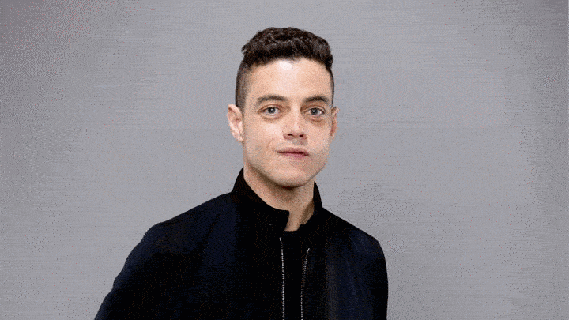

# Pixel-ART

Pixel-ART simply lets you pixel art your face and optionally add random fancy eyes on it. 



# Requirements 
In order to run the script these python modules should be installed.

- OpenCV for python  ``` pip install opencv-python ``` 
- PIL for python ``` pip install pillow ```


# Usage :

Place picture.jpg in the "pics/" folder. 

Run : 

```
python faces.py picture.jpg
```


Make sure :

- picture.jpg exists in your "pics/" folder.
- You have reading and writing permissions in "pics/" folder.

You'll find the result in your "pics/tmp_picture.jpg" file.

 
If you want to add awesome eyes to your picture just run :

``` 
python faces.py picture.jpg eye.png
```


# Quick description of the algorithm:  

The technique used to pixel art faces is simple and yet quite effective.

We colorized each grid of (N, N) pixels with the same color. (N = 20 by default and can be changed in faces.py)

For face and eyes detection we used the great OpenCV library.

For each face we found on the given picture, we wisely applied eyes detection.
(Since we usually find eyes on the face :v )  

If this script puts an eye on your mouth don't blame me. Instead, blame OpenCV.
If this script doesn't put any eye on your face; it doesn't mean you don't have eyes.
It simply means that OpenCV didn't find them or they were judged to be 
too small by the script.

Have fun Pixel-Arting your friends' faces.

# Perspectives

* Draw image picture with text (might not work with colorful pictures...)


More stuff can be found on http://k3nz0.github.io/
